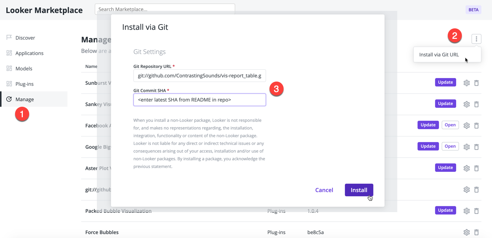

# Report Table for Looker

- Quick variance calculations
- Add subtotals (including column subtotals for tables with two levels of pivot)
- Add a header row to non-pivoted tables
- Organise pivot tables by pivot value, or by measure
- Easy red/black conditional format
- Use LookML tags to give default abbreviations to popular fields
- Reduce to a single dimension value for financial-style reporting
- Experimental: drag'n'drop ordering of flat tables

## Tagging fields in LookML

A common reporting requirement is grouping fields under headings, and abbreviating column headers when many columns are present. This can be repetitive work! The Report Table vis will pick up tags in the LookML model, with the format `"vis-tools:SETTING:VALUE"`.

The current tag settings available are `heading` and `short_name`.

    measure: number_of_transactions {
      tags: [
        "vis-tools:heading:Transaction Value",
        "vis-tools:short_name:Volume",
        "vis-tools:unit:#"
      ]
      type: count
      value_format_name: decimal_0
      drill_fields: [transaction_details*]
    }

## Notes

- Maximum of two pivot fields
- Subtotals are only for simple sums & averages (e.g. no Count Distincts or running totals)
- Variances only possible against other measures
  - Future version will allow comparisons against same measure for different pivot values (eg Period-over-Period)
  - For period-over-period analysis currently, create separate measures in LookML or as custom measures

## Marketplace Installation

URL: git://github.com/ContrastingSounds/vis-report_table.git

SHA: 1855e4c7061fe770b86e1fcb4129c719987a0ca0

