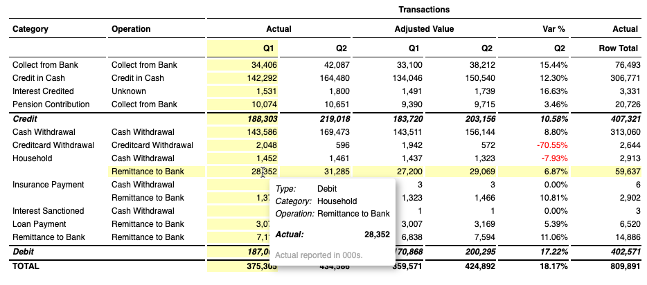
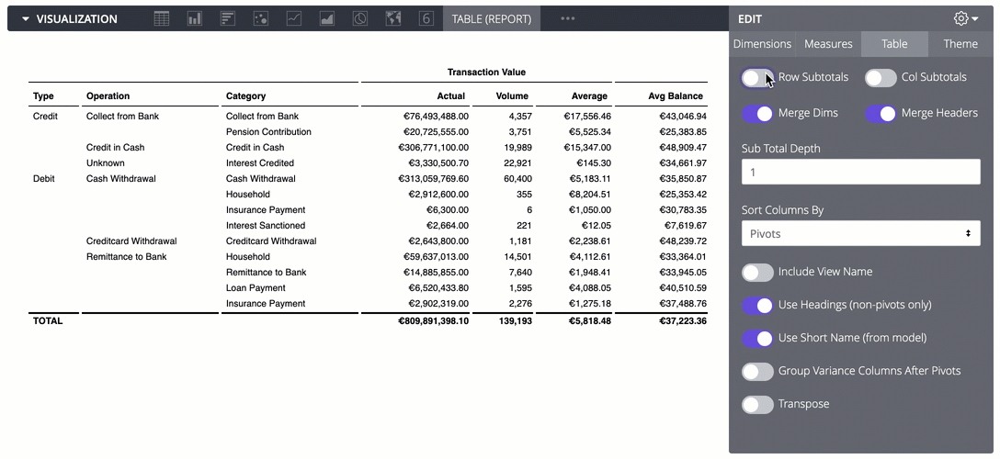

# Report Table for Looker

A table dedicated to single-page, enterprise summary reports. Useful for PDF exports, report packs, finance reporting, etc. Does not do multi-page tables and lists. Does look good for your year-on-year analysis. Originally created by [Jon Walls](https://github.com/ContrastingSounds/vis-report_table).



- Quick variance calculations
- Add subtotals (including column subtotals for tables with two levels of pivot)

  - Subtotals taken from Looker subtotals if available, otherwise performed as front-end calculation
- Add a header row to non-pivoted tables
- Organise measure columns by pivot value, or by measure

  - Flat tables (i.e. no pivots) can be organised by drag'n'drop
- Transpose (any number of dimensions)
- Easy red/black conditional format
- "Subtotal" format e.g. for highlighting transposed rows of measures
- Themes, including ability to test custom themes using your own css file
- Use LookML tags to give default abbreviations to popular fields
- Reduce to a single dimension value for financial-style reporting
- Drill-to-detail 


## Examples

*Drag'n'drop columns for flat tables*


*Tags in LookML for consistent headers and abbreviations*


*Subtotals and "show last dimension only"*



*Sort by Pivot or Measure*


*Set headers and labels*


*Even width columns or autolayout*


*Transposing and PnL style reports*


## Tagging fields in LookML

A common reporting requirement is grouping fields under headings, and abbreviating column headers when many columns are present. This can be repetitive work! The Report Table vis will pick up tags in the LookML model, with the format `"vis-tools:SETTING:VALUE"`.

The current tag settings available are `heading`, `short_name`, `unit`.

    measure: number_of_transactions {
      tags: [
        "vis-tools:heading:Transaction Value",
        "vis-tools:short_name:Volume",
        "vis-tools:unit:#"
      ]
      type: count
      value_format_name: decimal_0
      drill_fields: [transaction_details*]
    }

## Notes

- Maximum of two pivot fields
- Subtotals calculated at the front end are only for simple sums & averages
  - e.g. no Count Distincts, running totals, measures of type "number" with arbitrary calculations
  - The vis will use subtotals from the query response if available
  - The tooltip will alert users to "estimated" numbers

<!-- ## Using Custom CSS 

You can also apply your own custom styling by supplying a URL to a CSS file in the `Load custom CSS from:` option and selecting `Use custom theme` in the `Theme` tab.


In order to serve raw CSS files from your git provider, first pass the URL through [raw.githack.com](https://raw.githack.com/). Please use [this example template](/src/theme_custom_template.css) to help you get started with your customization. -->


## What if I find an error? Suggestions for improvements?
Great! Marketplace content -- including visualizations -- were designed for continuous improvement through the help of the entire Looker community and we'd love your input. To report an error or improvement recommendation, please reach out to Looker support via email to support@looker.com or via chat to submit a request. Please be as detailed as possible in your explanation and we'll address it as quick as we can.


### Interested in extending the visualization for your own use case?
#### Quickstart Dev Instructions
1.  **Install Dependecies.**

    Using yarn, install all dependencies
    ```
    yarn install
    ```
2. **Make changes to the source code**

3.  **Compile your code**

    You need to bundle your code, let's run:
    ```
    yarn build
    ```
    Recommended: Webpack can detect changes and build automatically
     ```
    yarn watch
    ```
    Your compiled code can be found in this repo.

**`./report_table.js`**: This visualization's minified distribution file. 

**`LICENSE`**: Looker's Marketplace content License file.

**`manifest.lkml`**: Looker's external dependencies configuration file. The visualization object is defined here.

**`marketplace.json`**: A JSON file containing information the marketplace installer uses to set up this project.

**`/src`**: This directory will contain all of the visualization's source code.

**`/src/report_table.js`**: The main source code for the visualization.

**`/node_modules`**: The directory where all of the modules of code that your project depends on (npm packages) are automatically installed.

**`README.md`**: This! A text file containing useful reference information about this visualization.

**`yarn.lock`**: [Yarn](https://yarnpkg.com/) is a package manager alternative to npm. This file serves essentially the same purpose as `package-lock.json`, just for a different package management system.

